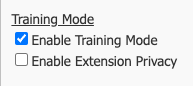

# myCloudPBX Call Codes

## Training Mode

Training Mode enables the ability to listen in / provide training on a call. This is useful for call centre training operations where a supervisor or manager can listen in to an agents live call and provide realtime feedback.

### Enable Training Mode on the PBX.

From the PBX Configuration screen, click ‘**Manage Applications**’. 

Once inside the add-ons screen, enable the 'Training Mode‘ option.

::: tip
After enabling Training Mode, all extensions will now have the ability to enable Training Mode & Training Mode privacy.
:::

### Enable Training Mode On Per User Basis.

Training Mode & Training Mode Privacy are configured on a per extension basis.

From the myCloudPBX Portal, click on '**_Offices & Users_**‘.  

Select the extension you wish to modify.

* To allow an extension to listen in on others, select '**_Enable Training Mode_**'.

* Selecting '_**Enable Extension Privacy**_‘ will ensure that no one can listen in on the extension. (useful for management etc.)

::: tip
Select both options to have the best of both worlds
:::

### Training Mode Call Controls

To begin Training Mode, dial **88** followed by the extension number to listen to.

During a call, a Manger/Supervisor has the ability to speak with a user, the remote party, or both using the below shortcuts.

These controls are based on the direction of the call.

#### **For Outgoing Calls:**
* Press **1** to speak with the _**Remote Party**_.
* Press **2** to speak with the _**PBX User**_.
* Press **3** to engage _**3 way chat**_.
* Press **0** Mute yourself.

#### **For Incoming Calls:**
* Press **1** to speak with the _**PBX User**_.
* Press **2** to speak with the _**Remote Party**_.
* Press **3** to engage _**3 way chat**_.
* Press **0** to Mute yourself.

## In-Call Shortcuts

#### Group Intercept

* Used to pickup a ringing call from within a Pickup Group. Dial **\*\*** to pickup a call ringing on a different handset.
  ::: tip 
  Note: This only works when in the same '_**pickup group**_'.
  ::: 

#### Direct Intercept

* Used to pickup a ringing call on any extension on the PBX. Dial **\*\*** followed by the extension number you wish to pickup.
  ::: tip
  EG: **\*\*** 101
  :::

#### Adhoc Call Recording

* Dial **#8** during a call to enable an adhoc recording. Dialling **#8** a second time will end the recording.

::: tip
**Note:** This will only start / stop the adhoc recording, if you have call recordings enabled globally, they will be unaffected by this.
:::

## Voicemail

#### Accessing Personal Voicemail

* Dial _**777**_ to access your Voicemail. Enter your _**PIN**_ when prompted.

#### Accessing Another Users Voicemail

* Dial _**778**_ to access another users Voicemail. Enter the _**Extension Number**_ followed by the _**PIN**_ when prompted.

#### Directly Dial Another Users Voicemail

* Dial _**6**_ followed by the _**Extension Number**_ of the user.

## Vertical Service Codes

#### Enable Click-to-Dial

* Dial _**12345**_ to enable Click-to-Dial.

#### **Delayed Echo Test:**

* Used to test audio quality. Dial **9195** and we'll repeat back to you after 5 seconds.

#### **Instant Echo Test:**

* Same as delayed echo test,  only instant. Dial **9196** and we'll repeat back to you.

#### Milliwatt Test:

* Dial **9197** for a Milliwatt Test.

#### Music On Hold Test:

* Dial **9199** to listen to you Music on Hold Stream.
