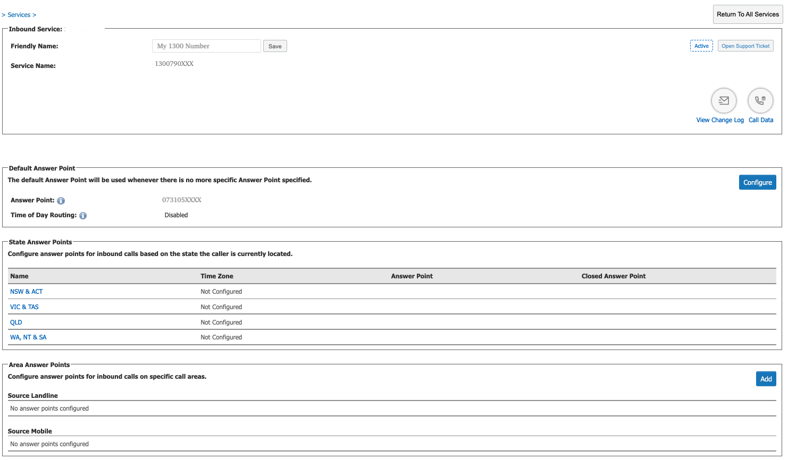
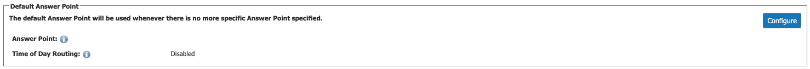
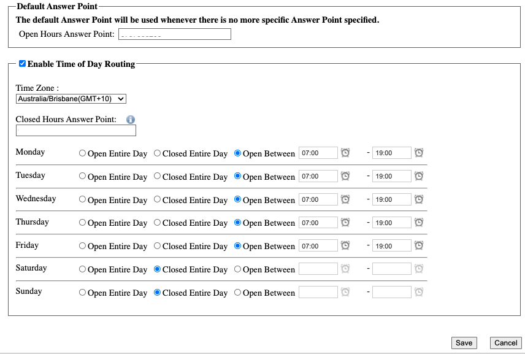
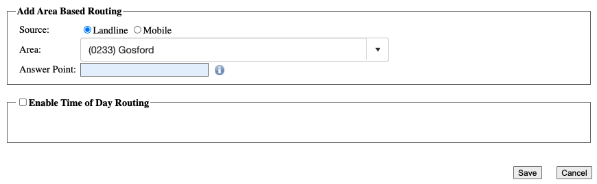

# **Inbound 1300**

- - -
An Inbound 1300 service allows customers to call your business from anywhere in Australia by dialling a single, national 1300 or 1800 number.

Your 1300 number can be configured with several options.

-	Divert Function: Divert to landline / mobile.

-	State Based Routing: Calls can be routed differently based on the location of the caller.

-	Time of Day Based Routing: Calls can be routed differently based on the time of the call.

This guide will show you how to configure your service.

**NOTE**: An '**Answer Point**' is the Full National Number that will ring when your 1300 number is dialled.

## Configuration

Once logged in, click '**My Services**' and select your Inbound 1300 service from under the '**Voice**' menu.

The first time you edit your service you will be greeted with the following screens.

### Answerpoint Preference
Note: The answer points will be used in the following preference.

1.	Area Answerpoints

2.	State Answerpoints

3.	Default Answerpoint.

### Default Answer Point & ‘**Time of Day**’ Routing

Click ‘**Configure**’ to add a ‘**default answer point**’. This will be used in the event there is no more specific answer point specified below.

Use the tickbox to enable ‘**Time of Day**’ routing.

Select the hours and the phone number to be used when ‘Closed’.

Click ‘**Save**’ when finished.

To apply your changes, click ‘**Apply Changes**’.

### Area Based Routing

Click the ‘**Add**’ button to enable area based routing.

Specify Landline or Mobile.

Locate the Area and set your Answerpoint.

Enable ‘**Time of Day**’ routing if required.

Click ‘**Save**’ when finished.

To apply your changes, click ‘**Apply Changes**’.

