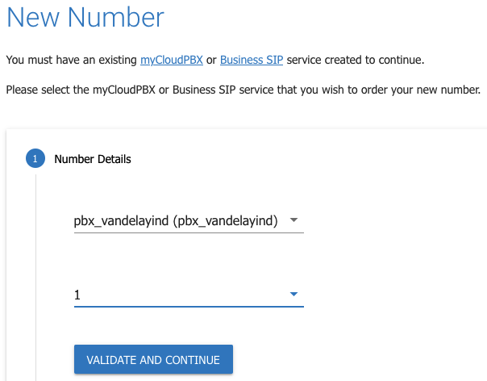

# **Number Management**

- - -

From the main menu, hover over ‘**Services**’ and click ‘**Phone Numbers**’.

On this page you can manage the full number lifecycle for your numbers.

## Current Numbers & Orders
View a list of all of your current numbers & active orders. 

Click the '**Current Numbers & Orders**' tile to begin.

On this page you can view all numbers on your account.

You can filter by Service, Block Size, and Status.

You can also view all the current number orders on your account by clicking the '**Current Orders**' button.

## Order new number
Order new phone numbers.

Click the '**Order New Number**' tile to begin a new number order.

#### Step 1

Click the 'Current Numbers & Orders'.
---

Select the Voice Service that you wish to order a new number for.

Select the block size. (quantity of numbers).

#### Step 2
---

Click '**Address Search**'

#### Step 4
---

Enter your address into the search box at the top of the page.

Once you have all information entered correctly, lick '**Search**'

## Vanity Numbers
**What are Vanity Numbers?**

Vanity numbers give customers the ability to use different numbers for outbound call presentation.

**Why are Vanity numbers used?**

When customers migrate from a traditional PBX to the cloud-hosted myCloudPBX platform, they often face the problem of numbers still being hosted on their traditional PBX during the migration process, or, a traditional telephone service such as ISDN or PSTN, or numbers that are not yet ready to be migrated to myCloudPBX.

Using the Vanity Number feature allows customers to use numbers on their traditional PBX but commence configuring the service, offices, and users all prior to migrating (porting) those numbers to myCloudPBX.

**How are they used?**

When a call is made the receiver sees the caller’s number as a number that may have been migrated yet, but already displays as though it is.

You can Add an existing phone number to your myCloudPBX service that isn't "hosted" on myCloudPBX, and use it to make calls, associate that number as the default outbound number on an office, and link that number to an extension as the outbound caller ID number when making calls.

**Benefits of Vanity Numbers?**

No waiting - Customers don’t have to wait until they have migrated their numbers to the new system, but can present their numbers as though they have already been processed, even though the migration process is still taking place.

#### Adding A Vanity Number
---

Click the '**Vanity Numbers**' tile to begin.

#### Step 1
---

Enter the following Information:

- **Select Your Service**: This is the service you wish to add the vanity number to.

- **Phone Number**: The phone number you wish to add.

- **Select Your Country**: Australia, New Zealand.

Click the '**Sumbit**' button when ready to proceed.

## Port Single Number
Port a single number.

Click the '**Port Single Number**' tile to begin.

#### Step 1

From the drop down list, select the Voice Service that you want to port the number(s) to.

Enter the phone number you wish to port.

Use the '**Invoice Upload**' button to upload a copy of your existing invoice for validation.

Once you have all information entered correctly, click '**Validate And Continue**'.

## Port Complex Number/s
Port one or more complex phone numbers for use with PBX & SIP Services

This is used for Complex (Cat-C) Number Porting.

Click the '**Port Complex Numbers**' tile to begin.

#### Step 1

Enter the following information:

- Slect from the dropdown, the Voice Service you wish to port the numbers onto.

- Select if the number is a '**Range**', '**Associated**', or '**Additional**' number. 

To add another number, click 

To upload supporting documentation (strongly recommended), click 

Once you have all numbers listed correctly, and your supporting documentation has been uploaded, click '**Validate and Continue**'.

## Port Number Validation
Request a Port Number Validation (PNV) – Valid for 24h

Click the '**Port Number Validation**' tile to begin.

#### Step 1
---

Enter the following Information:

- Select from the drop down list if the number is a Single, or a Range of Numbers.

- Use the  and  buttons to ensure all numbers have been added correctly.

Once you have all numbers listed correctly, click '**Validate and Continue**'.

#### Step 2
---

## Move Number
Move a phone number from one voice service to another.

Click the '**Move Number**' tile to begin.

#### Step 1
---

Enter the following information:

- **Origin Server**: This is where the number currently resides.

- **Select Phone Number**: This is the phone number you wish to move.

#### Step 2
---

Select the new Voice Service for the number.

Accept the Terms and Conditions.

Once you have everything correct, click '**Continue**'.

#### Step 3
---

Review your changes before clicking '**Submit Order**'.

## Disconnect Number
Cancel a phone number.

Click the '**Disconnect Number**' tile to begin.

#### Step 1
---

## Integrated Public Number Database (IPND)
Update the IPND for a phone number.

 
 Coming Soon!

