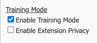
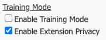

# Training Mode

#### Overview

Training Mode enables the ability to listen, or 'eavesdrop‘ on a call.
This is useful for call centre training operations where a supervisor or manager can listen in to an agents live call and provide realtime feedback.

## Enable Training Mode on the PBX.

From within the myCloudPBX portal, click on '**Manage Applications**'.
Locate and enable '**Training Mode**'.

::: tip
After enabling Training Mode, all extensions will now have the ability to enable Training Mode & Training Mode privacy.
:::

## Enable Training Mode On Per User Basis.

Training Mode & Training Mode Privacy are configured on a per extension basis.

To configure Training Mode on an extension, click on the '**Offices & Users**' icon from the PBX Configuration screen. 

Select the extension you wish to modify.

Scroll down until you reach the '**Security and Other Features**' section.

* To allow an extension to eavesdrop on others, select '**_Enable Training Mode_**'.

* Selecting '_**Enable Extension Privacy**_‘ will ensure that noone can eavesdrop on the extension. (useful for management etc.)

::: tip
Select both options to have the best of both worlds
:::

## In Call Controls

To begin Training Mode, dial **88** followed by the extension number to listen to.

During a call, a Manger/Supervisor has the ability to speak with a user, the remote party, or both using the below shortcuts.

These controls are based on the direction of the call.

#### **For Outgoing Calls:**
* Press **1** to speak with the _**Remote Party**_.
* Press **2** to speak with the _**PBX User**_.
* Press **3** to engage _**3 way chat**_.
* Press **0** Mute yourself.

#### **For Incoming Calls:**
* Press **1** to speak with the _**PBX User**_.
* Press **2** to speak with the _**Remote Party**_.
* Press **3** to engage _**3 way chat**_.
* Press **0** to Mute yourself.
