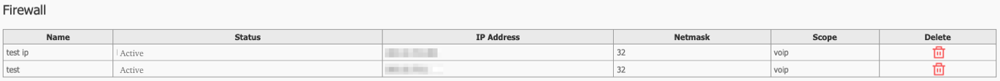
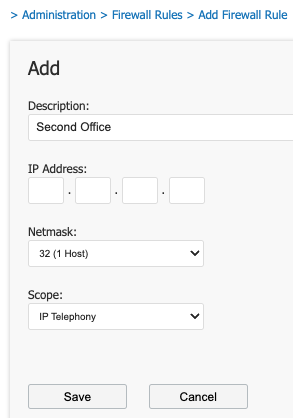

# **Administration**

- - -

## Manage Users
Hover over ‘**Admin**’ and click ‘**Manage Users**’

 

Here you can see each user, their login email, and their Role.

Click on the email to modify a user or click ‘**Create New User**’.

 

Here you can adjust the following information:

-	**First and last name**: Your preferred details.

-	**Email address**: (This is used to access the Ignition Portal, and also for any correspondence you have signed up for, such as Helpdesk, and Billing notifications.)
-	**Password**: Your login password.
-	**Mobile Number**: This will allow us to contact you if required.
-	**Timezone**: This is used to ensure your call detail records are in your preferred timezone.

On the right-hand side of the screen, select the notifications you would like to receive.

Click ‘**Save**’ when finished.

## Auto-Provisioning Firewall Rules

Auto-Provisioning is the method used to remotely configure handsets from the Ignition Portal.

For a phone to be allowed to auto-provision, the WAN IP Address must be added to the ‘**Firewall Rules**'. 

Hover over ‘**Admin**’ then select ‘**Firewall Rules**’.

 

Click ‘**Add Rule**’ to add a new IP Address to the allowed firewall rules.

 

## Client Associations

If you have any Client Associations, they will show here.

