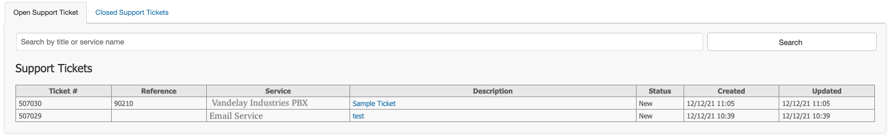
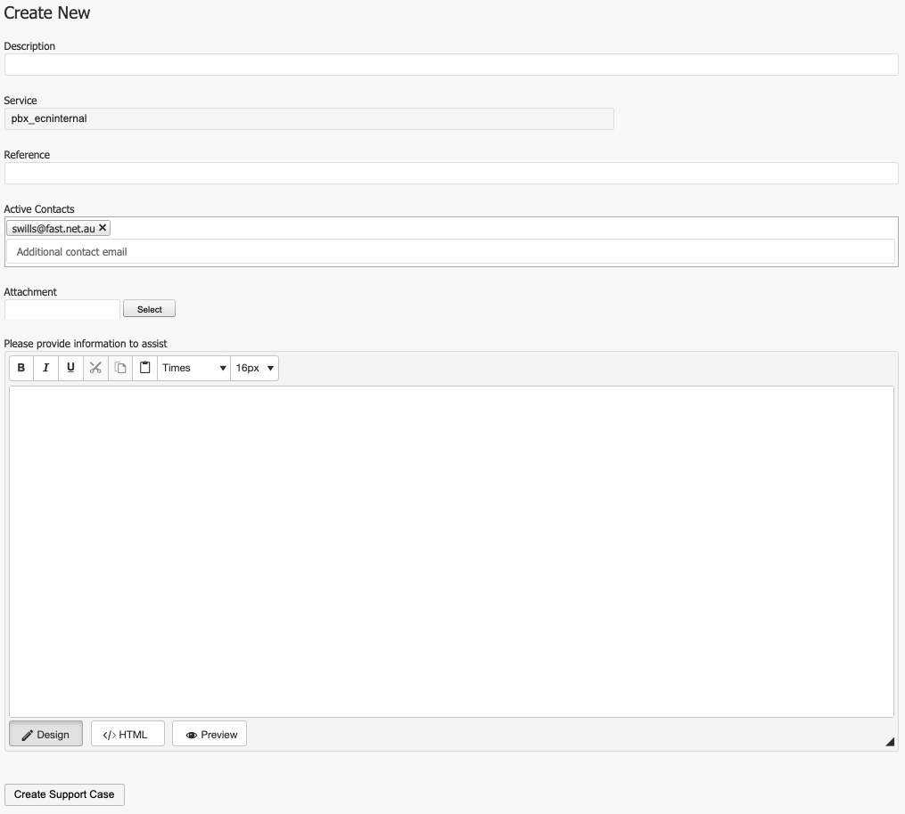

# **Helpdesk**

- - -

As part of our governance and risk strategy, Helpdesk Ticket interactions will only be available via the portal.

Anyone subscribed for ticket updates, will receive email notifications advising them that there is an update available inside the Helpdesk Portal.

No personal information will be sent via email.

To find out how to check your subscriptions, click [here](https://kb.channelhaus.com.au/guides/ignition/management_portals.html#account-management)

## Create a ticket
You can create a Helpdesk ticket from within any service directly, by clicking the ‘**Open Support Ticket**’.

You can also create by clicking ‘**Help Desk**’ from the menu at the top of the screen at any time.

Click any Helpdesk Ticket to view / edit updates.

Enter the following information:

-	**Description**: A detailed description for the ticket.
-	**Reference**: Your internal reference number.
-	**Active Contacts**: Any email that you wish to receive updates.

Click the Select button to upload supporting documentation.

Use the text box to fill in your ticket update / enquiry.

Click ‘**Create Support Case**’ to submit your update.
