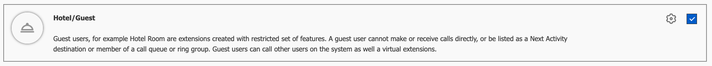
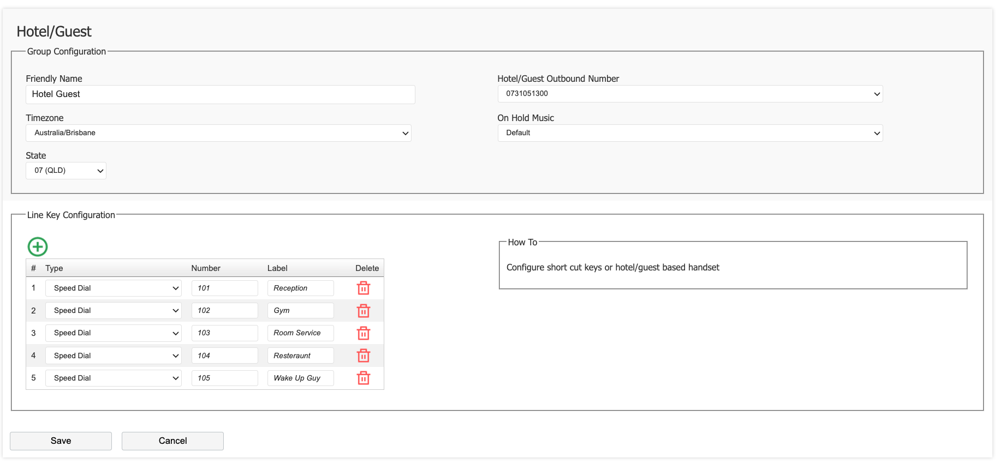
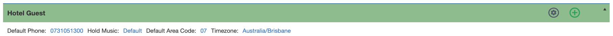
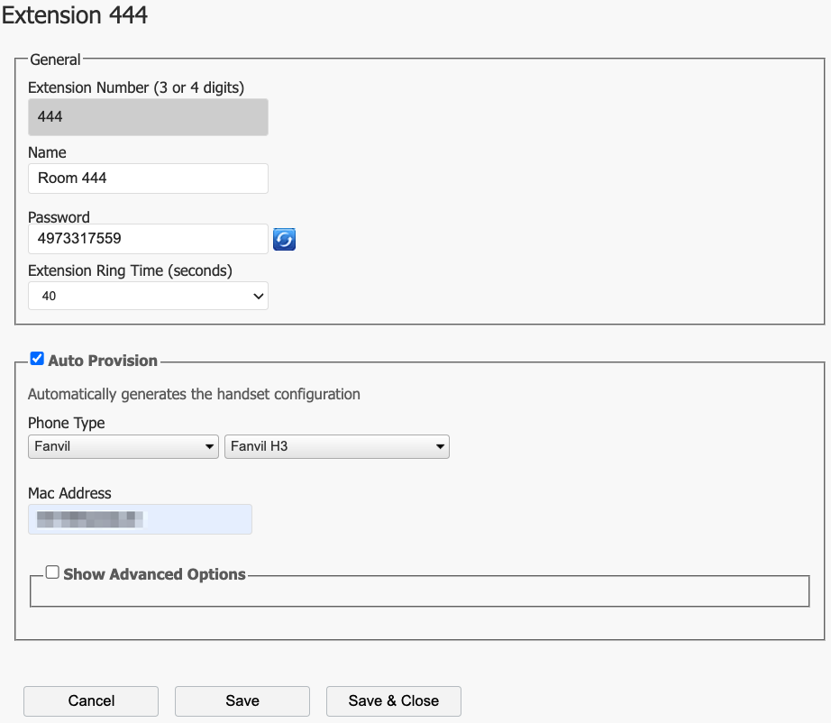
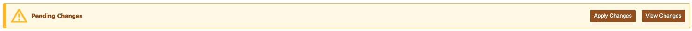
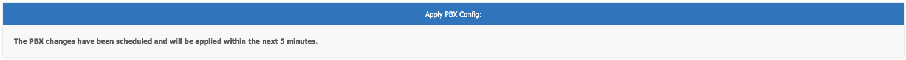

# Hotel / Guest Access

## What is Hotel / Guest Access? 

The 'Hotel / Guest Access' (Guest Access) Application, allows the simple creation of guest users with a limited feature set.

Guest users, for example Hotel Room are extensions created with restricted set of features. 
A guest user cannot make or receive external calls directly, or be listed as a Next Activity destination or member of a call queue or ring group.  
Guest users can however call other users on the system as well a virtual extensions.
 
Each gest user will be provisioned with the same set of line keys (eg: 'Reception', 'Gym', 'Room Service', etc).
 
Use Cases: 
  - This type of user is perfect for use in a Hotel Room, where you want to configure a large group of users rapidly.
  - School classrooms.
  - VoIP Cameras.
  - Doorbells & Gate Systems.
 

## Enable the Application

The first step is to enable the **'Hotel/Guest Access'** application for the PBX.

From the PBX Configuration screen, click ‘**Manage Applications**’. 

Once you have enabled the feature, you will see there is new icon for **'Hotel/Guest Access'** visible under the 'Active Applications' heading on the configuration page of the PBX.

## Configure Guest Access

Before you can start adding Guest Users, you must first configure the default settings for your Guest Office.

From the PBX homepage, click the 'Hotel/Guest Access' icon. 

On this page you must first set the following items:

* **Friendly Name**:  This is for your reference, and will be visible on the 'Offices & Users' page to differentiate from a standard office.
  
* **Timezone**: The timezone for the guest users.

* **State**: The state the guest users will be located.

* **Hotel/Guest Outbound Number**: This is the outbound Caller ID that be used if a guest user makes an outbound, external call.

* **On Hold Music**: This is the music on hold stream that will play if a guest user puts a caller on hold.

Click '**Save**' when finished.

## Configure Guest Users

To configure a Guest User, select '**Offices & Users**'  from the PBX Configuration screen. 

Click on the '**+**' icon to add a new user, or select an existing extension if to modify.

Enter the following information: 

* **Extension Number**: Specify the extension number. (Tip: In a hotel scenario, you might consider matching the room number).
  
* **Name**: The name that will show in on other phones when called from this extension.

* **Password**: The system will auto-generate a password for the phone, or you can specify one here. 
  
* **Extension Ring Time**: The time (in seconds) that the phone will ring for when dialled.
 

Select '**Auto Provision**'.

 

Select your phones make and model from the list of available devices.

Enter the MAC Address of the phone when prompted.

 

Click ‘**Save & Close**’ when finished. 

Your changes are now ready to be applied to the PBX.

Click ‘**Apply Changes**’.

