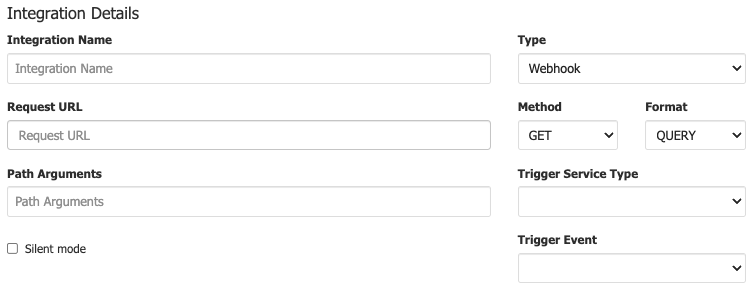
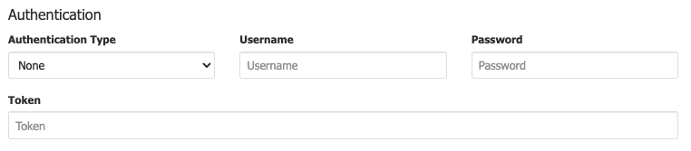

# **Integrations**

- - -
Integrations allow administrators to capture changes and events actioned via the myCloudPBX customer portal or a PBX.

Using the webhook, external workflows can be called, for example when your client creates a new myCloudPBX extension, creating a callback request inside your CRM for an account manager to complete a wellness check.

A Webhook is a way for 2 applications to communicate and share real-time data. A Webhook works in the same way as an API only in reverse - data is pushed from the application rather than pulled (API).

myCloudPBX Integrations can also be used to provide live data feeds to third-party or external billing systems.

There are two main types of Integrations that can be enabled.

-	myCloudPBX Integrations: These integrations are specific to an account.

-	Service Integrations: This integration is specific to one PBX.

## myCloudPBX Integrations

From the ‘**Admin**' menu, select '**Integrations**'.

 

On this page, you can see all of your active integrations.

-	Name: This name is for your reference.

-	Type: This is the type of Integration, currently Webhook only.

-	Trigger Service Type: This is the trigger, currently myCloudPBX only.

-	Trigger Event: Create User, Delete User, etc.

To _modify_ an integration, click 

To _enable_ an integration, click 

To _disable_ an integration, click  

To _delete_ an integration, click 

### Configuration

To create a new Integration, click ‘**Create New Integration**’.

 

Enter the following information:

-	**Integration Name**: This is for your reference

-	**Type**: Webhook

-	**Request URL**: The URL the payload will be sent to.

-	**Method**: POST | GET. Most endpoints will use POST. GET support for legacy applications.

-	**Format**: JSON | QUERY. JSON payload or QUERY string.

-	**Path Arguments**: Additional path arguments.

-	**Trigger Service Type**: Service type.

 

**Enter the following information:**

-	**Authentication Type**: None | Basic Auth | Token.

-	**Username**: Username [optional]

-	**Password**: Password [optional]

-	**Token**: Token [optional]

 

A custom HTTP header can be added to requests, a typical request will start with X-, for example X-{myvalue}.

Enter the following information:

-	**Request Name**: Name of the custom header value.
-	**Request Value**: Value to be sent.

**Field Values**

The payload can be customized by selecting a predetermined value from the drop down list. 

In all cases the Request Key can be configured to align with your application. 

The following values are specific to the myCloudPBX service type.

-	**Extension Number**: myCloudPBX users configured extension number.

-	**Name**: myCloudPBX users name.

-	**Outbound Phone Number**: Outbound number configured for the extension.

-	**Has Voicemail**: True: Voicemail is enabled. False: Voicemail is disabled.

-	**Enabled Calls**: Comma separated list of call types enabled for the extension. Local, National, Mobile, International, International Other, Premium, Other.

-	**Date/Time**: Date and Time of the request.

-	**Service UUID**: Unique identifier of the service. A list of service UUIDs can be obtained using myCloudPBX API.

-	**Service Name**: System configured name of the service.

-	**Service Friendly Name**: User configured name of the service.
When you are finished, click '**Save & Close**'.

