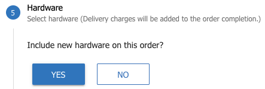
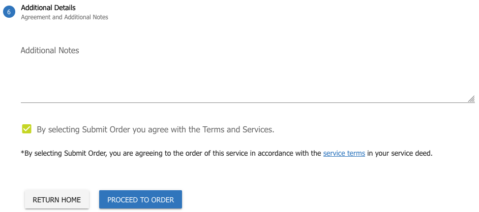

# **Orders**

- - -

From the orders menu, you can select one of three options.
-   Orders
-	New Order
-	Pricebook
-	Call Tariffs

## Orders

Click '**Orders**' to view all of your orders, and status updates for your orders.

Here you can search current, and completed orders by reference and order status.

You can also see correspondance as the job progresses.

## New Order

The ‘New Orders’ page allows you to order a number of services.

### MyCloudPBX

Order a new myCloudPBX service.

Click the myCloudPBX tile to order a new myCloudPBX service.

#### Step 1
---

Select your preferred product.

Click '**Continue**' when ready to proceed.

#### Step 2 
---

Select the number of extensions that you require for your new PBX.

Click '**Continue**' when ready to proceed.

#### Step 3 
---

Next you can select from either:

- **Assisted Setup**: One of our specialists will assist you with the configuration of your new PBX.

- **Self Service Activation**: You configure everything yourself.

If you opt for the Assisted Setup option, one of our specialists will contact you to assist with the process once your order has been submitted. 

Click '**Continue**' when ready to proceed.

#### Step 4 
---

If you would like to include hardware with your order, click **Yes**, if not, click '**No**' to skip to the next step.

Use the  and  icons to select the quantities required.

Click '**Continue**', or '**I dont need hardware**' depending on your requirements when ready to proceed.

#### Step 5
---

Enter the following information:

- **Customer Reference**: This will be used in our correspondance to you during the ordering process.

- **Friendly Name:** This will be allow you to identify the service in the Ember portal.

- **Additional Notes:** Anything else you think is relevant to the order.

Click the checkbox to agree to the Terms and Services.

Review the Order Summary on the right hand side of the screen and make sure everything is correct.

#### Step 6
---

Click '**Proceed To Order**'.

One final review of your order summary, then click '**Sumbit Order**' if everything is correct.

Your PBX will now be built and deployed automatically. 

#### Step 7
Have a coffee while your order is processed and your new PBX is created.

---

Once complete you will have the following options:

- **Add New Number**: This will take you to the New Number order screen.

- **Add New Number**: This will take you to the Number Manager, where you can port your numbers as required.

- **Close**: If you do not wish to port or add any numbers at this time.

Select as appropriate.

---

Your new PBX is now visible on the '**Services**' screen under the '**Voice**' tab and you can proceed with configuration.

### Business SIP

Order a new Business SIP service.

Click the Business SIP tile to order a new Business SIP service.

#### Step 1
---

Select your preferred product.

Click '**Continue**' when ready to proceed.

#### Step 2 
---

Select the number of channels required. 

 
 Any call out to the Public Telephone Network will require a channgel.  If you need to be able to make 10 simultaneous calls, you will require at least 10 channels.

Click '**Continue**' when ready to proceed.

#### Step 3
---

Select your activation method and contract term.

Click '**Continue**' when ready to proceed. 

#### Step 4

If you would like to include hardware with your order, click **Yes**, if not, click '**No**' to skip to the next step.

Use the  and  icons to select the quantities required.

Click '**Continue**', or '**I dont need hardware**' depending on your requirements when ready to proceed.

#### Step 5
---

Enter the following information:

- **Customer Reference**: This will be used in our correspondance to you during the ordering process.

- **Friendly Name:** This will be allow you to identify the service in the Ember portal.

- **Additional Notes:** Anything else you think is relevant to the order.

Click the checkbox to agree to the Terms and Services.

Review the Order Summary on the right hand side of the screen and make sure everything is correct.

#### Step 6
---

Click '**Proceed To Order**'.

One final review of your order summary, then click '**Sumbit Order**' if everything is correct.

Your Business SIP service will now be built and deployed automatically. 

#### Step 7
Have a coffee while your order is processed and your new Business SIP Service is created.

---

Once complete you will have the following options:

- **Add New Number**: This will take you to the New Number order screen.

- **Add New Number**: This will take you to the Number Manager, where you can port your numbers as required.

- **Close**: If you do not wish to port or add any numbers at this time.

Select as appropriate.

---

Your new Business SIP service is now visible on the '**Services**' screen under the '**Voice**' tab and you can proceed with configuration.

### Inbound 1300

Order or port 1300 & 1800 numbers.

Click the myCloudPBX tile to order a new myCloudPBX service.

#### Step 1
---

Choose from one of three options:

- Port an existing 1300 / 1800 Number.

- Order a new 1300 Number. 

- Order a new 1800 Number. 

#### Porting an Existing Number Step 1
---
If you selected Porting an existing number:

Fill in the following details:

- **Phone Number**: The 1300 / 1800 number you wish to port.

- **Business / Account Name**: Your Business / Account name as it appears on your invoice.

- **Losing Carrier Name**: The losing carrier.

- **Account Number**: Your Account Number as it appears on your invoice.

 It is critical that this information is correct as charges may apply.

#### Porting an Existing Number Step 2
---

Enter the Answerpoint (Phonenumber that will ring when the 1300/1800 number is dialled).

Click '**Contine**' when ready to proceed.

#### New 1300 / 1800 Number Order Step 1
---
If you selected New 1300 or 1800 Number

Select a number from the list.

Click '**Continue**' when ready to proceed.

#### New 1300 / 1800 Number Order Step 2
---

Select a number from the list.

Click '**Continue**' when ready to proceed.

#### New 1300 / 1800 Number Order Step 3
---

Enter the Answerpoint (Phonenumber that will ring when the 1300/1800 number is dialled).

Click '**Continue**' when ready to proceed.

#### Step 2
---

Select '**Inbound 1300/1800 Service**'.

Click '**Continue**' when ready to proceed.

#### Step 3
---

Select '**Inbound 1300/1800 Activation**'.

Click '**Continue**' when ready to proceed.

#### Step 4
---

Enter in any additional notes that you feel relevant.

Agree to the Terms and Services.

Review the Order Summary on the right hand side of the screen and make sure everything is correct.

#### Step 5
---

Click '**Proceed To Order**' when ready to proceed.

Click '**Submit Order**' when ready to proceed.

#### Step 6
---

Have a coffee while your order is processed.

Here you can choose to '**Place a New Order**', or '**View your existing Orders**'.

### Manage Phone Numbers

Manage your existing phone numbers.

To learn about Embers Number Management, click [here](https://kb.cadiz3.com.au/guides/ember/Number_Manager.html#current-numbers-orders)

### Nbn Internet

Order Home nbn, Business nbn, or private Cloud Internet services.

### Fibre Services

Request a qualification for Ethernet and complex data services.

## Pricebook
View your pricebook.

## Call Tariffs 
View your call Tariffs.

