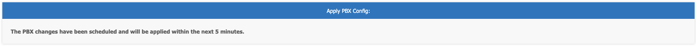

# **PBX Configuration**

- - -

## Blocklist Numbers
In the event you wish to block a number from calling you, add it to the myCloudPBX Blocklist.

From the PBX Configuration page, click ‘**Blocklist**’.  

Click '**Add Blocked Callers**’.

Add the phone number, and click '**Save**'.

You will never receive a call from this number again.

**Note:** This will only work if the caller ID is public. 

## Call Diversions

Call diversions can be enabled in a number of ways, the easiest of which is to enable '**Call Forward All**' on the inbound route.

Select ‘**Call Routing**’ from the PBX homepage.

Find the number for which you wish to enable call forwarding on and then click '**view/edit**'.

 
Scroll down until you see the '**Enable Forward All**' option.

Make sure that it is ticked and note down the '**Allocated Dial Code**'

**To Enable Call Forwarding**: Dial the allocated dial code, followed by the destination.

**To Disable Call Forwarding**: Dial the allocated dial code, and after the tone, hangup.

Note
 
 The Allocated Dial Code is unique for each call route.

## Call Recordings

Call recordings can be enabled for inbound calls (per call route), outbound calls (per extensions), or both.

::: tip
**Note:** Once enabled, calls will be recorded even if they are not answered.
:::

### Enable Call Recording Application

To turn on call recordings for a call route, you must first enable the call recording functionality on your PBX.
From the PBX Configuration screen, click ‘**Manage Applications**’. 

Scroll down until you see '**Call Recording**'.

Tick ‘**Call Recording**' on.

You will now need to go back to the PBX Configuration page to enable recordings for either inbound calls, outbound calls, or both as per your needs.

### Inbound Calls

To enable call recordings for an inbound route, select '**Call Routing**' from the PBX homepage.

Find the number for which you wish to enable call recordings and then click '**view/edit**'.

Click the checkbox to '**Enable Call Recording**' for all inbound calls.

Scroll down to the bottom of the page and click '**Save**' to save your changes.

Your changes are now ready to be applied to the PBX.

Click ‘**Apply Changes**’.

### Outbound Calls

To enable call recordings for outbound calls, select '**Offices & Users**'  from the PBX Configuration screen. 

Select the extension you wish to modify.

Scroll down to ‘**Security & Other Features**’, then enable ‘**Record calls from this extension**’.

Click ‘**Save**’ when finished. 

Your changes are now ready to be applied to the PBX.

Click ‘**Apply Changes**’.

### Shortcut Codes

During an active call you can use the following shortcut codes.

**Call Recordings must be enabled.**

-	If a recording is active **#8** will stop the current recording.

-	If a recording is not currently active **#8** will start an adhoc recording.

-	If a recording or adhoc recording is active **#7** will enabling masking of the recording.

-	If a call is currently masked **#7** will stop masking.

### Accessing Call Recordings

There are two ways to access your call recordings.

-	FTP

-	Hosted PBX Dashboard

### Call Recording Encryption

**Generating a Public/Private key pair.**

To enable call recording encryption you will first need to generate a Public/Private key pair.

To create a Public/Private key-pair we recommend using OpenSSL

#### Windows users

Download OpenSSL for Windows (https://wiki.openssl.org/index.php/Binaries (opens new window))

To run the commands below, go to the OpenSSL32 directory on your PC, and change to the /bin directory

**Note:** You may need to open the command prompt with admin privileges (run as administrator) and you will need to restart your computer before generating a certificate.

#### Mac users

OpenSSL comes shipped with Mac OS X version 10.6.2 onwards.

You can use Terminal to run OpenSSL (Open Applications > Utilities > Terminal or search for ‘**terminal**’ using the search bar in the top right hand corner of your screen) run the commands below.

**Note:** You may need to run each OpenSSL command lines with elevated privileges. – add _sudo_ before each command as needed.

#### Using OpenSSL

The basics command line steps to generate a private and public key using OpenSSL are as follows:

COMMAND
 
openssl req -newkey rsa:2048 -nodes -keyout myprivatekey.pem -x509 -days 1825 -out mypublickey.pem

WARNING!
 
STORE YOUR PRIVATE KEY IN A SAFE, SECURE LOCATION. IF THE PRIVATE KEY IS LOST, ENCRYPTED FILES CAN NOT BE DECRYPTED

#### Enabling Call Recording Encryption

To turn on call recordings for a call route, you must first enable the call recording functionality on your PBX.

From the PBX Configuration screen, click ‘**Manage Applications**’. 

Enable the call recording encryption and paste a copy of your **PUBLIC KEY**. 

 
To learn how to generate a private key, click [here](https://kb.channelhaus.com.au/guides/ignition/pbx_configuration.html#call-recording-encryption)

Click '**Save**'

Recorded calls will now have an “.enc” suffix to identify call recorded with a user provided public key.

#### Decrypting Call Recordings

To decrypt call recordings, use the following command. (Adjust for your filename..)

COMMAND
 
openssl smime -decrypt -binary -in RECORDING_NAME.mp3.enc -inform DER -out RECORDING_NAME.mp3 -inkey myprivatekey.pem

## Conference Calls

There are two ways to access the myCloudPBX conference bridge.

* A dedicated inbound number.
* A virtual extension. (internal use speed dial).

::: tip
**Note:** Each inbound call on your conference line will count toward you PBX channel count. If you are unsure how many channels you have available, contact your administrator.
:::

### Dedicated Conference Number

From the PBX homepage, select '_**Call Routing**_.

If you are modifying an existing an existing call route, click 'view/edit' next to the number you wish to modify, otherwise click 'Add Call Route'.

When creating a call route for a Conference line, you will need to fill in the following information:

**Timezone:** This will be used to ensure correct timestamps.

**Phone Number:** This is the inbound number you will be using.

**Call Alert Name:** This is mostly for your reference.

::: tip
**Add a Passcode:** If you wish to enable a passcode, check '**_Caller Passcode_**' and enter in a **Passcode** that will need to be entered for anyone dialling your conference number.
:::

The last thing you'll need to configure is the '_**Activity**_':

* **Activity Type:** Conference (Basic)
* **Activity:** Choose a conference room number

Scroll down the page and click '**Save**' when you are finished.

Your changes are now ready to '***Apply***' to your PBX.

### Internal Speed Dial

Creating a virtual extension directly to the conference room allows you to enter a conference without dialling the full 10 digit phone number.

To begin, select '_**Virtual Extensions**_' from the PBX homepage.

Click '**_Add Virtual Extension_**'.

Enter the following information:

* **Name:** This is for your reference.
* **Extension Number:** This is the 3 or 4 digit speed dial number.
* **Activity Type:** Conference Basic
* **Activity:** Select a conference room number.

Click '**Save**' when you are finished.

Your changes are now ready to '***Apply***' to your PBX.

## Emergency Routing and Failover
----

myCloudPBX Emergency Routing provides automatic routing of a call to an alternate activity in the event that all selected extensions are not online. This feature can provide automatic failover in the event of an on-site issue (such as a power outage or Internet issue).

Note that you may choose between 1 and 3 extensions, however all selected extensions must be offline for the emergency activity to be used.

This alternate activity can be anything you like, such as a custom voicemail message or even a mobile number.

### Configure Emergency Routing
----

This guide assumes you are already logged into the IGNITION Portal and have selected your PBX.

The first thing you are going to do is select '_**Call Routing**_' from the PBX homepage.

Click '**_View/Edit_**' on the number you wish to modify.

Locate the '_**Emergency Routing**_' section and tick the option on.

Here you will need to select the extensions you wish to 'monitor'. (You should select the main phones that ring for this number).

Next, select the '_**Emergency Activity Type**_'.

This will most likely be either 'Announcement' (for voicemail) or 'External Phone Number'.

Finally, select the '_**Emergency Activity**_'.

Once finished, click '**Save**'.

Your changes are now ready to '***Apply***' to your PBX.

Click '***Apply Changes***'.

## Holiday Conditions

A **_Holiday Condition_** allows you to automatically divert your calls to another activity during a pre-definited time range.

This could be a mobile number, voicemail, or even just a different group of extensions.

This guide will help you configure a Holiday Condition for your PBX.

### Configuring a Holiday Condition

To configure a Holiday Condition, click on the '**Holidays**' icon from the PBX Configuration screen. 

If you want to edit an existing condition, you can click '**View/Edit**' on that, otherwise click '**Add Condition**'.

Give the holiday condition a **Name**. (This is for your reference later).

Add in as many dates that your office will be **closed**.

::: warning
**Note:** The office will be closed for the **entire day and night** selected.
:::

On the right hand side of the screen you can choose what will happen on any given holiday.

In this instance we're going onto an '**_Announcement_**' called 'After Hours Voicemail'.

Click '**_Save_**' when you're finished making changes.

### Enable the Holiday Condition

You will now need to assign the holiday condition to an inbound route.

Click '**_Return to Service_**' to go back to the PBX homepage and select '**_Call Routing_**'.

Locate the number you wish to apply the Holiday Condition to, and click '**View/Edit**'.

From the drop-down list select the Holiday Condition you wish to apply to the call route.

Once finished, click '**Save**'.

Your changes are now ready to '***Apply***' to your PBX.

Click '***Apply Changes***'.

## Voicemail

### Personal Voicemail

Each extension has the option to have personal voicemail enabled. This voicemail will only plan if an extension is **directly dialled** (not part of a ring group).

#### Enable Voicemail on Extension

To configure voicemail on an extension, click on the '**Offices & Users**' icon from the PBX Configuration screen. 

Select the extension you wish to modify.

Scroll down until you reach the '**Voicemail**' section.

To enable the voicemail feature, tick '**Enable Voicemail**'

Here you can set the following information:

* **Voicemail PIN**: This is the PIN you will enter to access the voicemail system.
* **Send Messages to my Mailbox**: When selected, the voicemail will be emailed to the address nominated.
* **Delete messages after emailing them**: When selected emails will no longer be retrievable from your handset and will be only accessed via email.

Scroll down the page and click '**Save**' when you are finished.

Your changes are now ready to '***Apply***' to your PBX.

Click '***Apply Changes***'.

#### Accessing Voicemail

To access the Voicemail system, dial **777** from your phone, or press the '_**Voicemail**_' Button on your handset if it has one.

The voicemail system will then prompt you to enter your _**PIN**_ followed by the **\#** key.

Once authenticated to the voicemail system, you will be able to follow the prompts to record your personal voicemail messages, and listen to voicemails left for you.

